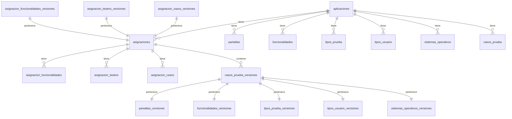

# **📊 Diagrama ER en Mermaid (Módulos Separados)**  

```mermaid
erDiagram

    aplicaciones ||--o{ asignaciones : tiene
    aplicaciones ||--o{ pantallas : tiene
    aplicaciones ||--o{ funcionalidades : tiene
    aplicaciones ||--o{ tipos_prueba : tiene
    aplicaciones ||--o{ tipos_usuario : tiene
    aplicaciones ||--o{ sistemas_operativos : tiene
    aplicaciones ||--o{ casos_prueba : tiene

    asignaciones ||--o{ asignacion_funcionalidades : tiene
    asignaciones ||--o{ asignacion_testers : tiene
    asignaciones ||--o{ asignacion_casos : tiene
    asignaciones ||--o{ casos_prueba_versiones : contiene

    casos_prueba_versiones ||--|| pantallas_versiones : pertenece
    casos_prueba_versiones ||--|| funcionalidades_versiones : pertenece
    casos_prueba_versiones ||--|| tipos_prueba_versiones : pertenece
    casos_prueba_versiones ||--|| tipos_usuario_versiones : pertenece
    casos_prueba_versiones ||--|| sistemas_operativos_versiones : pertenece

    asignacion_funcionalidades_versiones ||--|| asignaciones : pertenece
    asignacion_testers_versiones ||--|| asignaciones : pertenece
    asignacion_casos_versiones ||--|| asignaciones : pertenece
```
